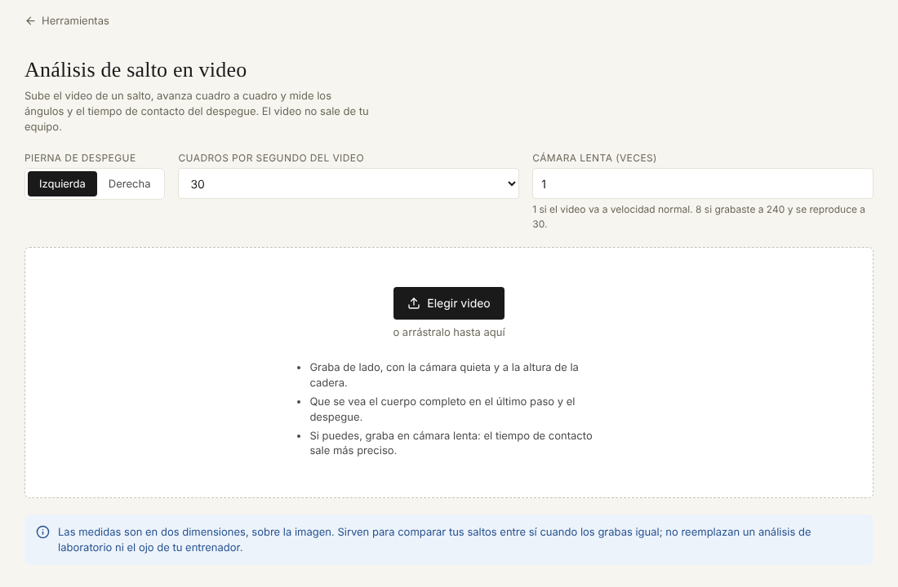

# Análisis de salto en video

Sube el video de un salto, avanza cuadro a cuadro y mide los ángulos del cuerpo y el tiempo de contacto del despegue.

**Abrirlo:** https://juanvasquez-herramientas.vercel.app/biomecanica

## El problema

Revisar la técnica de un salto con el video del celular es pausar, adelantar con el dedo y opinar a ojo. Los programas que miden ángulos son de escritorio, cuestan o piden subir el video a un servidor.

## Qué hace

- Detecta el cuerpo en cada cuadro y dibuja el esqueleto encima del video.
- Mide cinco ángulos: rodilla, cadera y tobillo de la pierna de despegue, rodilla de la pierna libre e inclinación del tronco.
- Avanza de a un cuadro o de a diez, con botones o con las flechas del teclado.
- Se marcan el **apoyo** y el **despegue**, y calcula el tiempo de contacto, la flexión máxima de la rodilla y cómo cambió cada ángulo.
- Tiene en cuenta los cuadros por segundo y la cámara lenta del video.
- Guarda un salto como referencia y compara los siguientes contra ese.
- Exporta el cuadro como imagen y los datos del contacto a Excel (CSV).
- El video se procesa en el navegador: no se sube a ninguna parte.

## Cómo está hecho

| Archivo | Qué tiene |
|---|---|
| `Biomecanica.tsx` | El visor, los controles y las marcas de apoyo y despegue. |
| `Resultados.tsx` | Indicadores, gráfica de la rodilla y tabla de apoyo contra despegue. |
| `angulos.ts` | La geometría: ángulo en una articulación e inclinación del tronco. |
| `tiempos.ts` | De cuadros a segundos, tiempo de contacto y resumen del tramo. |
| `detector.ts` | La carga del detector de postura (MediaPipe Pose). |
| `dibujo.ts` | Pintar el cuadro, el esqueleto y los ángulos. |
| `modelo.ts` | Los ajustes que se guardan y el salto de referencia. |
| `*.test.ts` | Pruebas de la geometría, los tiempos y lo guardado. |

## Decisiones

- **El tiempo de contacto se muestra con su margen de error.** A 30 cuadros por segundo no se puede saber nada más fino que un cuadro (0,033 s), y un contacto de salto alto dura unos 0,15 s. Por eso el resultado dice "± un cuadro" y recomienda grabar en cámara lenta.
- **Los ángulos se miden en píxeles, no en fracciones.** El detector entrega posiciones entre 0 y 1. En un video que no es cuadrado, medir sobre esas fracciones deforma los ángulos.
- **Se dice cuándo no confiar.** Si el detector no ve bien una articulación, el cuadro lleva un aviso. La pantalla también aclara que son medidas en dos dimensiones: sirven para comparar saltos grabados igual, no reemplazan un laboratorio.
- **La curva se suaviza poco y solo si hay datos.** El detector tiembla unos grados entre cuadros. Con nueve cuadros o más se promedia cada punto con sus vecinos; con menos, se dejan los datos como salen.
- **La parte pesada baja solo cuando se usa.** El detector y su modelo se cargan al subir el primer video, no al abrir la página.

## Lo que hace falta saber

El modelo de postura se descarga de los servidores de Google la primera vez (unos 9 MB) y después queda en la caché del navegador. Sin conexión a internet esa primera vez, la herramienta no puede detectar.

## Ideas para después

- Comparar dos saltos lado a lado, sincronizados en el despegue.
- Medir la velocidad horizontal del último paso con una distancia de referencia en el piso.
