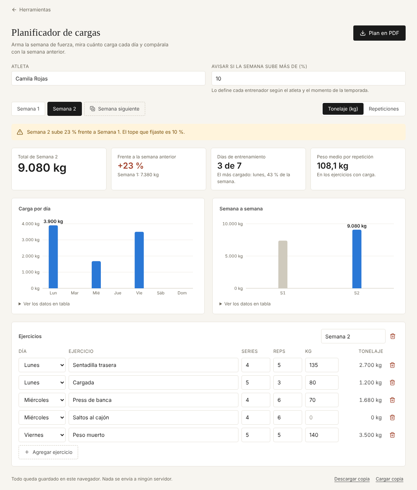

# Planificador de cargas

Arma la semana de fuerza, muestra cuánto se carga cada día y la compara con la semana anterior.

**Abrirlo:** https://juanvasquez-herramientas.vercel.app/cargas

## El problema

Al planear el gimnasio en un cuaderno, es fácil subir de una semana a otra mucho más de lo que se quería: se agrega una serie aquí, cinco kilos allá, y nadie hace la suma. El salto se nota cuando el atleta ya está fundido.

## Qué hace

- Cada semana es una lista de ejercicios con día, series, repeticiones y kilos.
- Calcula el tonelaje (series × repeticiones × kilos) por ejercicio, por día y por semana.
- Compara cada semana con la anterior y muestra el cambio en porcentaje.
- Avisa si la semana sube más que el tope que fijó el entrenador.
- La **semana siguiente** arranca como copia de la actual, que es como se planea en la práctica.
- Permite medir en tonelaje o en repeticiones, para los ejercicios sin peso.
- Saca el plan de la semana en PDF.

## Cómo está hecho

| Archivo | Qué tiene |
|---|---|
| `Cargas.tsx` | La pantalla: semanas, indicadores, gráficas y tabla de ejercicios. |
| `Documento.tsx` | El plan de la semana como sale en el papel. |
| `carga.ts` | Las cuentas: tonelaje, repeticiones, resumen por día y comparación entre semanas. |
| `modelo.ts` | La forma del plan, agregar y quitar semanas, y la validación de lo guardado. |
| `*.test.ts` | Pruebas de los dos archivos de lógica. |

## Decisiones

- **Se quitó el "riesgo de sobreentrenamiento".** La versión anterior mostraba un porcentaje de riesgo calculado con una fórmula inventada. Un número así parece ciencia y no lo es. Ahora la herramienta muestra el dato real (cuánto sube la semana) y el tope lo pone el entrenador, que es quien conoce al atleta.
- **El peso medio solo cuenta los ejercicios con carga.** Los saltos al cajón no tienen kilos; si entraran al promedio lo bajarían sin razón.
- **Dos gráficas, una pregunta cada una.** "¿Cómo se reparte la semana?" y "¿cómo viene la progresión?". En la segunda, la semana activa va en color y las demás en gris.

## Ideas para después

- Plantillas por fase de la temporada.
- Registrar lo que de verdad se hizo frente a lo planeado.
