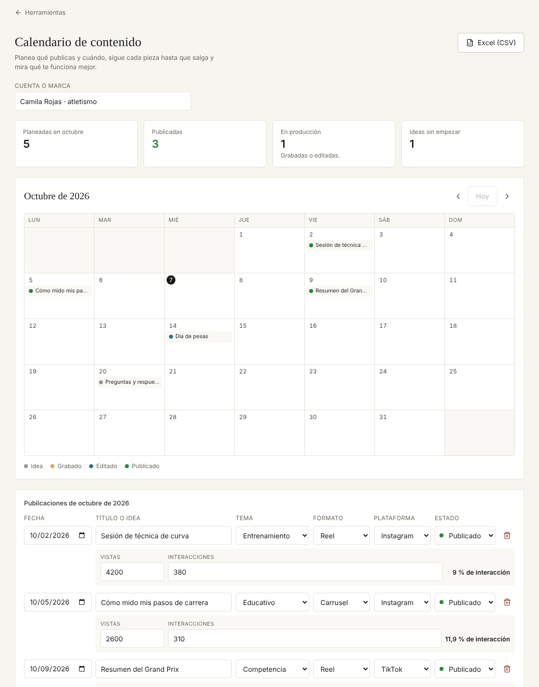

# Calendario de contenido

Organiza las publicaciones del mes, sigue cada una hasta que sale y muestra qué tipo de contenido funciona mejor.

**Abrirlo:** https://juanvasquez-herramientas.vercel.app/contenido

## El problema

Quien maneja sus propias redes publica cuando se acuerda y no sabe qué le funciona. Las herramientas de planeación que existen están hechas para equipos de mercadeo: piden cuenta, conectar las redes y pagar.

## Qué hace

- Muestra el mes en un calendario; con un clic en un día se agrega una publicación.
- Cada publicación tiene tema, formato, plataforma y estado: idea, grabado, editado o publicado.
- Cuando ya se publicó, se anotan las vistas y las interacciones.
- Con eso calcula qué tema, qué formato y qué plataforma dan mejor resultado.
- Cuenta cuántas piezas hay planeadas, publicadas, en producción y sin empezar.
- Exporta el mes a Excel (CSV).

## Cómo está hecho

| Archivo | Qué tiene |
|---|---|
| `Contenido.tsx` | La pantalla: calendario, lista y comparación. |
| `mes.ts` | Armar las semanas de un mes, moverse entre meses y dar el nombre en español. |
| `analisis.ts` | Contar por estado y comparar el rendimiento por tema, formato o plataforma. |
| `modelo.ts` | La forma del calendario y cómo se valida lo guardado. |
| `*.test.ts` | Pruebas del calendario y del análisis. |

## Decisiones

- **Las vistas se escriben a mano.** Conectarse a Instagram o TikTok pide permisos, revisión de la aplicación y un servidor. Para una persona con pocas publicaciones al mes, copiar dos números es más rápido y no depende de nadie.
- **El estado no se muestra solo con color.** Cada ficha lleva un punto de color y el estado escrito para lectores de pantalla; debajo del calendario está la leyenda.
- **La semana empieza en lunes.** Es como se planea acá, y `Date` empieza en domingo, así que el corrimiento tiene sus propias pruebas.
- **La comparación ordena por vistas promedio, no por total.** Si no, gana siempre el tema del que más se publica.

## Ideas para después

- Arrastrar una publicación de un día a otro.
- Repetir una publicación cada semana.
