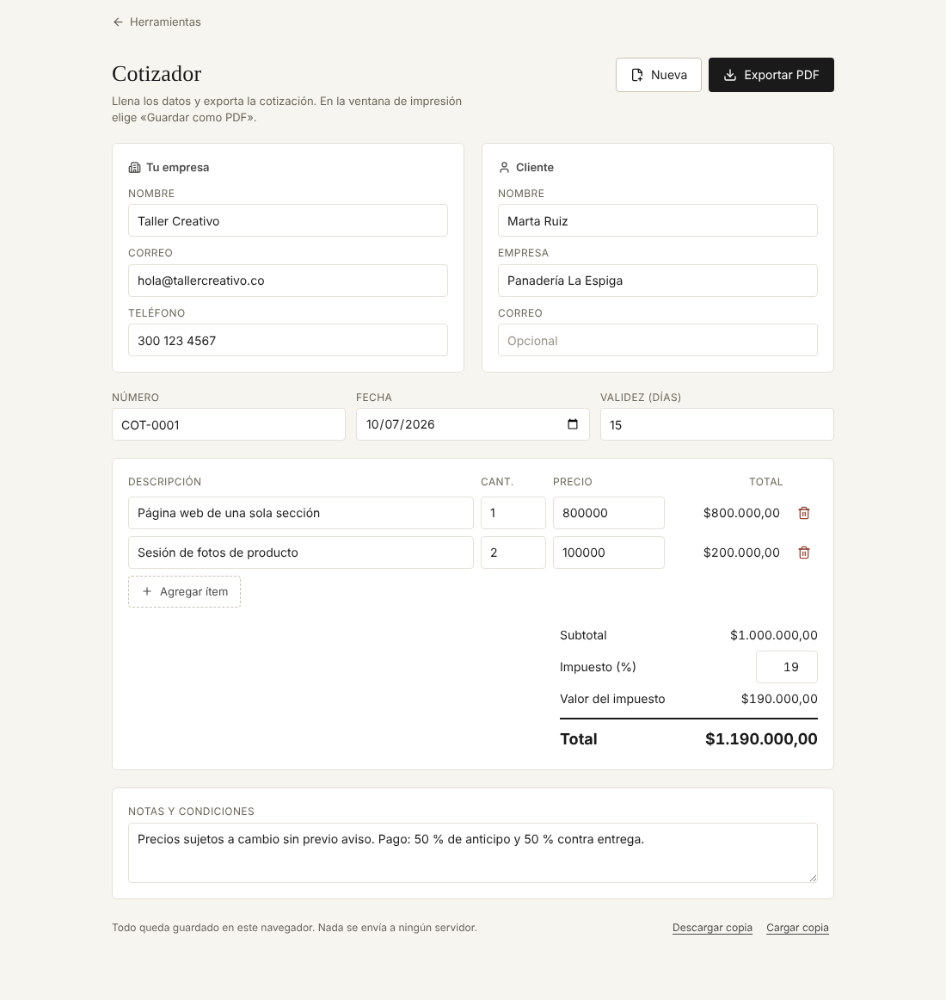

# Cotizador

Arma una cotización y la exporta en PDF, sin Word ni Excel.

**Abrirlo:** https://juanvasquez-herramientas.vercel.app/cotizador

## El problema

Quien vende servicios o productos por encargo cotiza varias veces por semana. Lo normal es copiar un documento viejo, cambiarle el cliente y los valores a mano y volver a sumar. Ahí es donde se cuela un total mal calculado o el nombre del cliente anterior.

## Qué hace

- Calcula el total de cada línea, el subtotal, el impuesto y el total mientras se escribe.
- Exporta un documento limpio en PDF desde la ventana de impresión del navegador.
- Guarda todo en el navegador: si se cierra la pestaña, la cotización sigue ahí.
- El botón **Nueva** limpia el cliente y los ítems, conserva el impuesto, la validez y las notas, y sube el consecutivo (`COT-0001` → `COT-0002`).
- Los datos de la empresa se escriben una sola vez y sirven también en la [propuesta de servicios](../propuesta).
- Descarga una copia de seguridad en un archivo y la vuelve a cargar, por ejemplo para pasar los datos a otro equipo.
- Funciona en celular: cada ítem pasa a ser un bloque en vez de una fila.

## Cómo está hecho

| Archivo | Qué tiene |
|---|---|
| `Cotizador.tsx` | El formulario y el estado. |
| `Documento.tsx` | La cotización como sale en el papel. |
| `calculo.ts` | Las cuentas: total por línea, subtotal, impuesto y total. |
| `cotizacion.ts` | La forma de una cotización, cómo se crea, cómo se reinicia y cómo se valida. |
| `*.test.ts` | Pruebas de los dos archivos de lógica. |

## Decisiones

- **Los números se guardan como texto.** Un campo numérico puede estar vacío mientras la persona escribe. Guardar el texto tal cual y convertirlo solo al calcular evita que el campo salte a `0` o a `NaN`.
- **Todo se redondea a centavos en cada paso.** Así lo que se ve en pantalla suma exacto con lo que sale en el PDF, y no aparecen errores de coma flotante como `0.1 + 0.2`.
- **Vacíos y negativos cuentan como cero.** Una cotización a medio llenar nunca muestra un total raro.
- **La fecha es la del equipo, no la de UTC.** Con `toISOString()` una cotización hecha en Colombia después de las 7 p. m. salía con la fecha del día siguiente.
- **Siempre queda una fila.** El botón de quitar se desactiva cuando solo hay un ítem.
- **Lo guardado tiene versión.** La primera versión guardaba la empresa dentro de la cotización. Cuando la empresa pasó a ser un dato compartido, lo que ya había en el navegador de cada persona se migró en vez de perderse, y eso tiene su prueba.

## Ideas para después

- Descuento por línea o sobre el total.
- Elegir la moneda.
- Guardar varias cotizaciones y volver a abrir una anterior.
