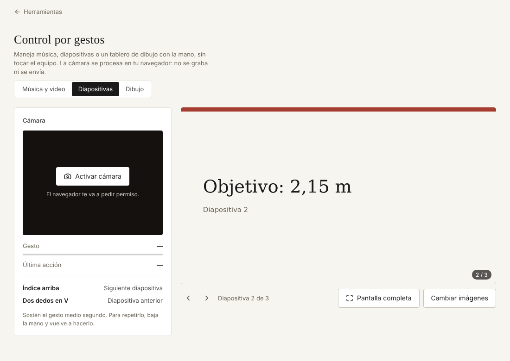

# Control por gestos

Maneja un reproductor, unas diapositivas o una pizarra con la mano frente a la cámara, sin tocar el equipo.

**Abrirlo:** https://juanvasquez-herramientas.vercel.app/gestos

## El problema

Hay momentos en que no se puede tocar el teclado: exponiendo lejos del computador, con las manos sucias en la cocina o en el taller, entrenando. Este es un experimento para ver hasta dónde llega el reconocimiento de gestos corriendo solo en el navegador.

## Qué hace

- **Música y video:** carga archivos del equipo. Palma abierta reproduce o pausa, índice arriba pasa a la siguiente, dos dedos en V vuelve, pulgar arriba o abajo cambia el volumen.
- **Diapositivas:** carga la presentación exportada como imágenes. Índice arriba avanza, V retrocede. Tiene pantalla completa.
- **Dibujo:** se dibuja con la punta del índice, la palma mueve sin dibujar, la V cambia de color y el puño sostenido borra. El dibujo se guarda como imagen.
- Muestra qué gesto está viendo, cuánto falta para que cuente y cuál fue la última acción.
- Todo se puede manejar también con el ratón y el teclado.
- La cámara se procesa en el navegador: no se graba ni se envía.

## Cómo está hecho

| Archivo | Qué tiene |
|---|---|
| `Gestos.tsx` | La cámara, el ciclo de lectura y la guía de gestos. |
| `regla.ts` | La regla que decide cuándo un gesto se convierte en una acción. |
| `modos.ts` | Qué hace cada gesto en cada modo. |
| `reconocedor.ts` | La carga del reconocedor de gestos (MediaPipe). |
| `Reproductor.tsx`, `Diapositivas.tsx`, `Pizarra.tsx` | Los tres modos. |
| `regla.test.ts` | Pruebas de la regla de los gestos. |

## Decisiones

- **Un gesto cuenta solo si se sostiene.** El reconocedor lee unas 15 veces por segundo. Si cada lectura disparara la acción, levantar un dedo pasaría quince diapositivas. La regla pide sostener medio segundo, actúa una vez y exige soltar para repetir.
- **El volumen sí se repite.** Subir de a un paso por gesto sería desesperante, así que esas acciones se repiten mientras la mano siga ahí.
- **Un parpadeo no reinicia la cuenta.** El reconocedor pierde la mano por un instante de vez en cuando. Se le perdonan 200 milisegundos.
- **Borrar pide el doble de tiempo.** Es lo único que no se puede deshacer.
- **La regla es una función pura.** Recibe el estado, el gesto y la hora, y devuelve el estado nuevo y la acción. Por eso se prueba sin cámara ni navegador.
- **La versión anterior simulaba.** Mostraba un reproductor de mentira y unas diapositivas fijas. Ahora maneja archivos de verdad.

## Lo que hace falta saber

El modelo de gestos se descarga de los servidores de Google la primera vez (unos 8 MB) y después queda en la caché del navegador. Funciona mejor con buena luz y la mano a medio metro de la cámara.

## Ideas para después

- Elegir qué gesto hace qué.
- Controlar una presentación en PDF sin exportarla.
