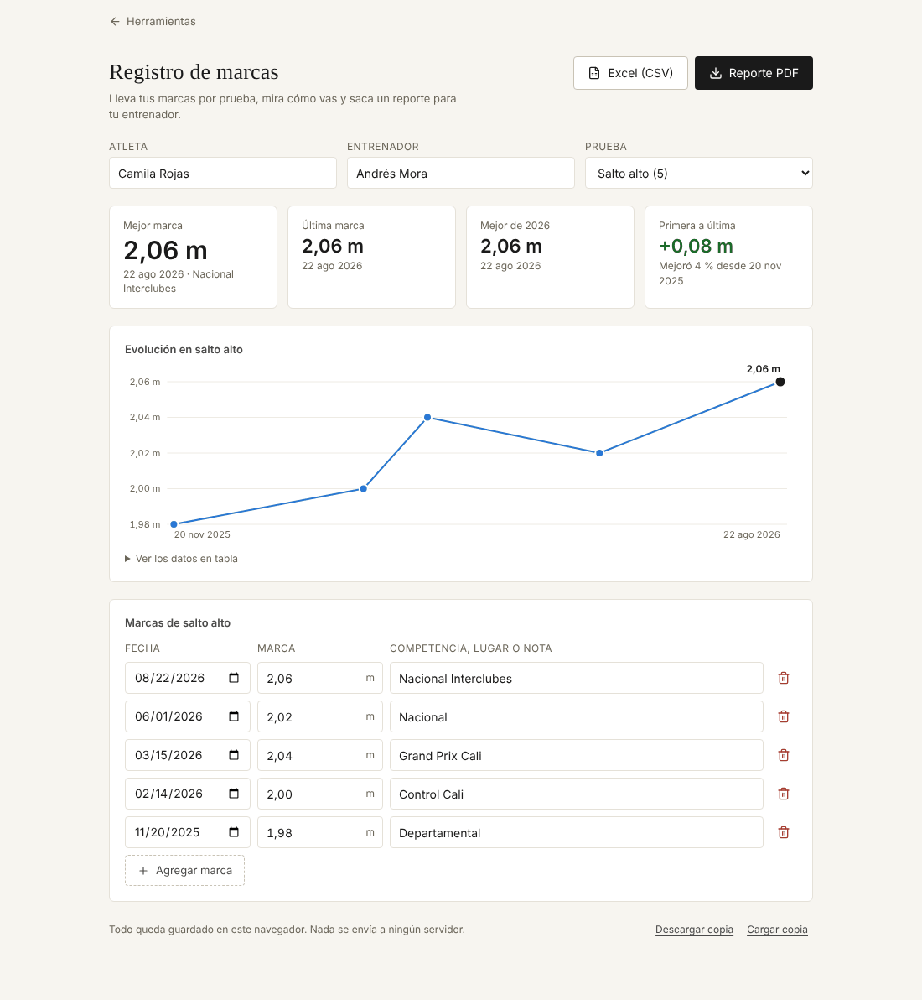

# Registro de marcas

Lleva las marcas de un atleta por prueba, muestra la progresión y saca un reporte para el entrenador.

**Abrirlo:** https://juanvasquez-herramientas.vercel.app/marcas

## El problema

Las marcas de un atleta terminan repartidas entre planillas de competencia, notas del celular y la memoria del entrenador. Cuando hace falta saber cuánto mejoró en la temporada, hay que reconstruir todo.

## Qué hace

- Registra marcas de pruebas de pista, de campo, de fuerza y de test físicos.
- Entiende cómo se escribe cada una: `2,06` en metros, `10,84` en segundos, `1:55,10` en minutos.
- Sabe en qué pruebas gana el número más alto (saltos, lanzamientos) y en cuáles el más bajo (carreras).
- Muestra la mejor marca, la última, la mejor del año y cuánto cambió de la primera a la última.
- Dibuja la progresión en el tiempo y resalta la mejor marca.
- Exporta a Excel (CSV) y arma un reporte en PDF.

## Cómo está hecho

| Archivo | Qué tiene |
|---|---|
| `Marcas.tsx` | La pantalla: indicadores, gráfica y tabla. |
| `Documento.tsx` | El reporte como sale en el papel. |
| `pruebas.ts` | El catálogo de pruebas: unidad y si gana el mayor o el menor. |
| `marca.ts` | Leer una marca escrita por una persona y darle formato. |
| `resumen.ts` | Mejor, última, mejor del año y cambio entre la primera y la última. |
| `modelo.ts` | La forma de la bitácora y cómo se valida lo guardado. |
| `*.test.ts` | Pruebas de la lectura de marcas y del resumen. |

## Decisiones

- **"Mejor" depende de la prueba.** La versión anterior siempre tomaba el número más alto como la mejor marca, así que en una carrera felicitaba por el peor tiempo. Ahora cada prueba dice si gana el mayor o el menor.
- **La marca se guarda como la escribió la persona.** Se convierte a número solo para comparar y dibujar. Una marca que no se entiende se avisa al lado del campo y no entra en las cuentas.
- **La coma decimal es la de acá.** Se acepta coma o punto al escribir, y el CSV sale con punto y coma como separador para que Excel en español lo abra bien.
- **La gráfica no parte de cero.** Entre 1,98 m y 2,06 m la diferencia que importa no se vería. El eje se ajusta a los datos y los valores exactos están en la tabla.

## Ideas para después

- Varios atletas en el mismo registro.
- Marcar el viento y si la marca es válida para ranking.
