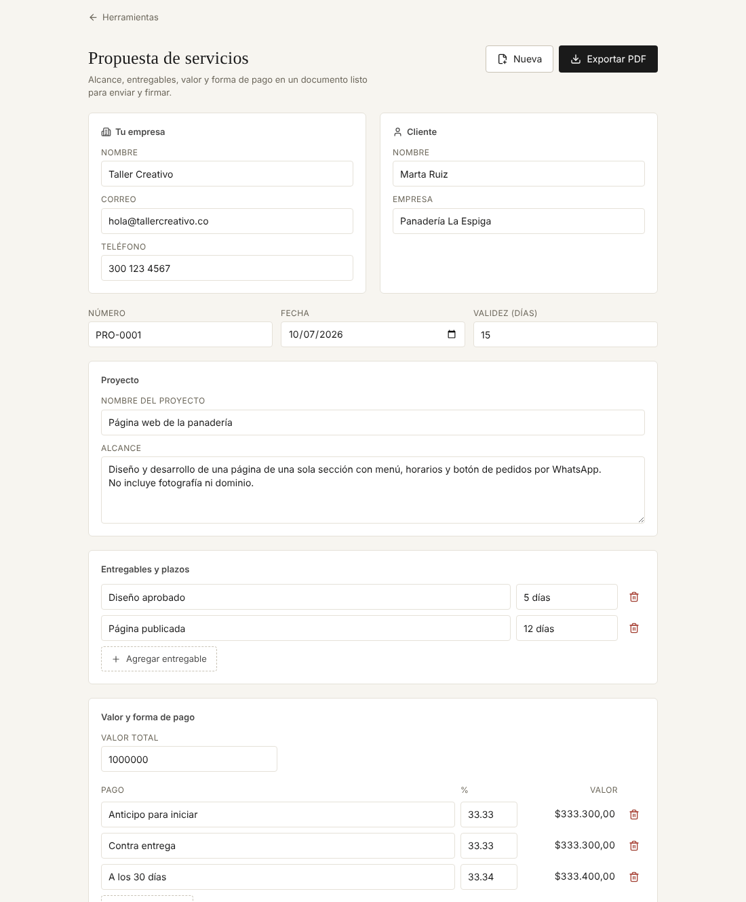

# Propuesta de servicios

Deja por escrito qué se va a hacer, qué se entrega, cuánto vale y cómo se paga, en un PDF listo para firmar.

**Abrirla:** https://juanvasquez-herramientas.vercel.app/propuesta

## El problema

Muchos trabajos independientes se acuerdan por chat. Cuando el cliente pide "una cosita más" o se demora en pagar, no hay un papel que diga qué se había acordado. Armar ese papel en Word cada vez da pereza, y por eso no se hace.

## Qué hace

- Reúne en una sola hoja las partes, el alcance, los entregables con su plazo, el valor y la forma de pago.
- Reparte el valor entre los pagos según su porcentaje y avisa si no suman 100 %.
- Deja espacio para condiciones (qué no incluye, cuántas rondas de cambios) y para las dos firmas.
- Exporta en PDF, lleva el consecutivo (`PRO-0001`) y guarda todo en el navegador.
- Usa los mismos datos de empresa del [cotizador](../cotizador): se escriben una vez.

## Cómo está hecho

| Archivo | Qué tiene |
|---|---|
| `Propuesta.tsx` | El formulario y el estado. |
| `Documento.tsx` | La propuesta como sale en el papel, con los espacios de firma. |
| `calculo.ts` | El reparto del valor entre los pagos y la suma de porcentajes. |
| `modelo.ts` | La forma de una propuesta, cómo se crea, cómo se reinicia y cómo se valida. |
| `*.test.ts` | Pruebas de los dos archivos de lógica. |

## Decisiones

- **Se llama propuesta, no contrato.** La versión anterior decía "contrato" y traía cláusulas legales de relleno. Un texto legal genérico da una seguridad falsa, así que se quitó: la herramienta deja claro lo acordado y lo dice en una nota; para un contrato de verdad hace falta un abogado.
- **El último pago se lleva los centavos que sobran.** Tres pagos de 33,33 %, 33,33 % y 33,34 % sobre un valor cualquiera pueden no sumar exacto si cada uno se redondea por su lado. El último se calcula como el total menos los anteriores.
- **El aviso de los porcentajes no bloquea.** Mientras la persona escribe, los pagos pasan por valores que no suman 100. Se avisa, pero se deja seguir.

## Ideas para después

- Guardar varias propuestas y volver a abrir una anterior.
- Convertir una propuesta aceptada en cotización o en cuenta de cobro.
