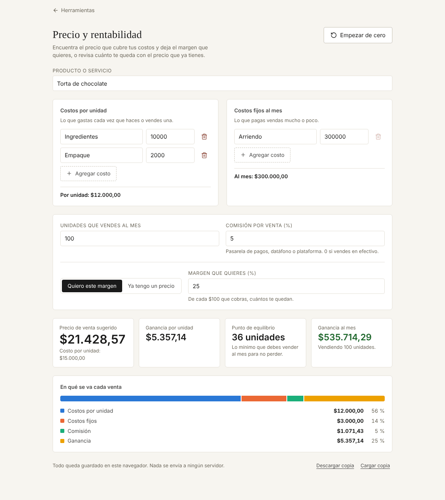

# Precio y rentabilidad

Calcula a cómo hay que vender algo para cubrir los costos y ganar lo que se quiere, o cuánto deja el precio que ya se tiene.

**Abrirla:** https://juanvasquez-herramientas.vercel.app/rentabilidad

## El problema

En muchos negocios pequeños el precio se pone mirando a la competencia o sumándole "un poquito" al costo. Sin contar el arriendo, los servicios ni la comisión del datáfono o de la plataforma, se puede vender mucho y aun así perder plata.

## Qué hace

- Suma los costos de cada unidad y reparte los costos fijos del mes entre las unidades que se venden.
- Tiene dos modos: **quiero este margen** (dice el precio) y **ya tengo un precio** (dice el margen real).
- Descuenta la comisión por venta, que se cobra sobre el precio y no sobre el costo.
- Calcula el punto de equilibrio: cuántas unidades hay que vender al mes para no perder.
- Muestra en una barra en qué se va cada venta: costos, fijos, comisión y ganancia.
- Avisa cuando el precio deja pérdida o cuando el margen pedido es imposible.

## Cómo está hecho

| Archivo | Qué tiene |
|---|---|
| `Rentabilidad.tsx` | El formulario, los indicadores y la barra. |
| `calculo.ts` | Todas las cuentas: costo por unidad, precio, margen, punto de equilibrio. |
| `modelo.ts` | La forma del análisis y cómo se valida lo guardado. |
| `*.test.ts` | Pruebas de los dos archivos de lógica. |

## Decisiones

- **El margen es sobre el precio de venta.** Con costo de 15.000 y margen de 25 %, el precio no es 15.000 × 1,25. Es 15.000 ÷ (1 − 0,25 − comisión), porque el margen y la comisión salen del precio. Es el error más común al poner precios.
- **Un margen imposible se dice, no se calcula.** Si el margen más la comisión llegan a 100 %, la fórmula divide por cero. La versión anterior mostraba `Infinity`; ahora aparece un aviso que explica por qué no se puede.
- **El punto de equilibrio se redondea hacia arriba.** No se venden 35,9 unidades: con 35 todavía se pierde.
- **Si cada venta deja pérdida, no hay punto de equilibrio.** Se muestra así en vez de un número negativo.

## Ideas para después

- Comparar dos o tres precios lado a lado.
- Guardar varios productos.
